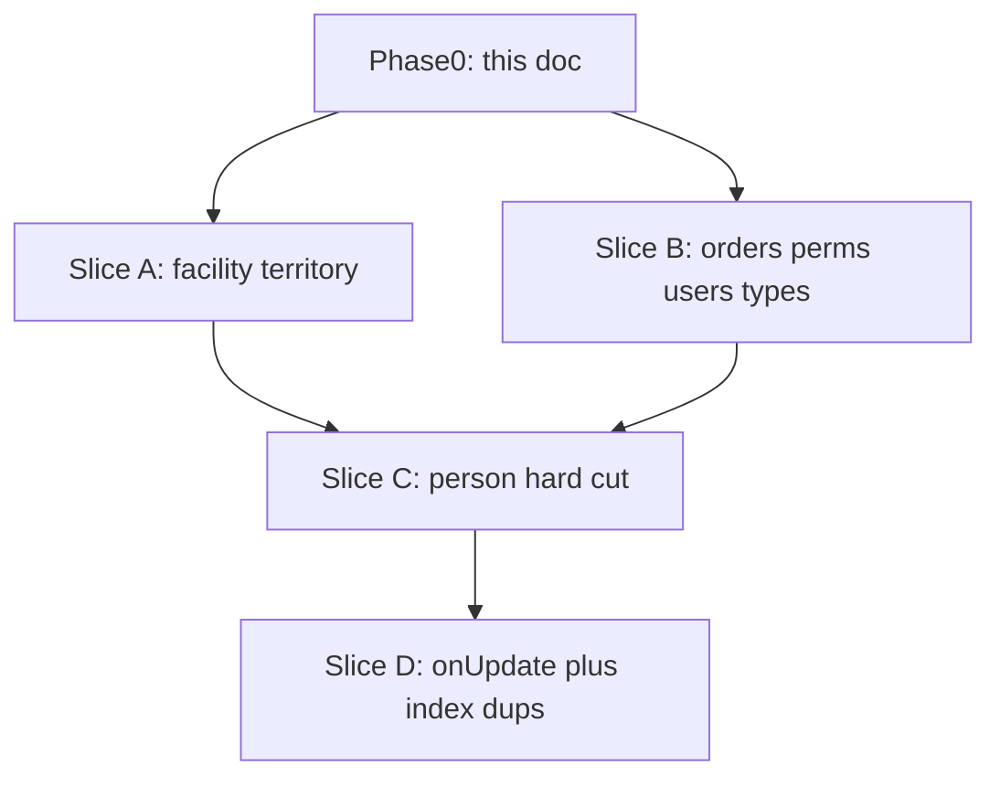

# DB overhaul — merged P0 plan

**Living coordination doc.** Merges:

1. [ADR 0004 — person / facility model](../architecture/adr/0004-person-facility-model.md)  
2. [DB suggestion triage (#1–#40)](db-suggestion-triage.md)

**Does not replace** those files. They remain sources of truth for their domains. This file is the **execution merge**: clash resolutions, slice order, absorbed items, open questions.

Last updated: 2026-08-07 (Slice A `0047` facility/territory integrity + JOIN display)

---

## 1. SoT rules

| Surface | Wins |
|---|---|
| Person / affiliation / occupation **shape** | ADR 0004 |
| Facility / territory / orders / perms / users hygiene | `db-suggestion-triage.md` |
| Shared constraints (semantic types, no ingest `source_*`, empty-DB blast) | Both (aligned) |
| **Execution order / clash resolution** | **This file** |

Empty CRM DB → hard cut OK. Never fix old `professionals` / PK-as-code `occupations` then redo under `persons`.

---

## 1.1 ID strategy + app scope (**LOCKED**)

| Decision | Lock |
|---|---|
| **CRM PKs / FKs** | `bigint` identity (`mode: "number"` in Drizzle) — **not** cuid `text` |
| **Cutover** | **Hard wipe / rebuild OK** — prod exists but app not live; CRM data not precious. No cuid→bigint remap tables. No dual-write. |
| **Main calendar (`0045`)** | Rebase onto `main`, then **regenerate** calendar/interactions on bigint FKs (do not keep cuid calendar then convert). |
| **Meili** | Wipe + full reindex after ID cutover |
| **In-wave apps (**M12**)** | **`packages/database` + `apps/api` + `apps/mobile` only** |
| **Out of wave** | **`apps/web`** — may stay broken / unshipped until a later PR |
| **Per-slice compile fixes (**M9**)** | Schema + **api + mobile** fixes in each slice PR — not web |

Wire convention: JSON/API/Dart use **numbers** for CRM ids (same type family end-to-end). No mixed string/number ids in the in-wave apps.

---

## 2. Clash matrix

### Hard clashes (resolved for execution)

| Triage | ADR | Execution resolution |
|---|---|---|
| **#11 D** `reference_year` → `smallint` | **Q26 = C** drop | **DROP** column on remade `occupations`. Triage text historical; this file wins for code. |
| **#20** CHECK `ended_at >= started_at` (pros/reps) | **Q21** no `started_at` on `person_facilities`; **Q22** `ended_at` + `ended_by` only | **Split:** (1) `person_facilities` → CHECK `(ended_at IS NULL) = (ended_by_user_id IS NULL)` — no `started_at` / `end_reason`. (2) Tables that keep `started_at` (e.g. `facility_consultant_assignments`) → keep `#20` as `ended_at >= started_at`. |
| **#3** FK occupation → `occupations.occupation_code` | Remake `occupations` (`id` + `cnes_id text`) + `person_facility_occupations` | FKs only to **new** shape. Never FK to dropped PK-as-code. |
| **#11 C** flags → boolean | **Q25 = A** boolean nullable | Aligned → Slice C. |
| **#11 H / #12** `professionals.birth_date` → `date` | `persons.birth_date` = `date` | Create `persons` correctly; drop `professionals`. No intermediate migrate. |
| Outside-list “person redesign XL separate” | ADR accepted | **Same P0 wave** as Slice C (not after hygiene on old tables). |

### Soft / absorb

| Triage | Execution |
|---|---|
| **#13** `updated_at` auto-bump | **LOCKED: Drizzle `$onUpdate`** on CRM + new `person_*` tables (Slice D). No PG trigger strategy. |
| **#35** SKIP provenance / ingest `source_*` | Matches ADR Q21 (affiliations always manual). |
| **#31** Later perm registry | Still Later. CASL `PERSON` (D13) lands with access work, not blocked on #31. |
| **#10** UTA history Later | Consultant assignments keep start/end history; person affiliations intentionally thinner. |

### No clash (orthogonal — same wave)

`#2` composite vertical FKs · `#3` non-occupation missing FKs · `#4` facility identity · `#6` GiST · `#8` hierarchy P0 bits · `#11` A/B/E/F/G/I · `#14` case-insensitive email · `#17` Emultec renames · `#30` permission NULLS · `#36` dup indexes.

---

## 3. P0 inventory (merged)

### From triage — implement as-written (Slices A/B/D)

| # | Work | Slice |
|---|---|---|
| 2 | Composite cross-vertical FKs | A |
| 3 | Missing FKs (+ #8 FK/self-CHECK); occupation FK → **via Slice C** | A / C |
| 4 | Facility identity (unique legal doc, mun∈state, JOIN display, DROP city/state text) | A |
| 6 | GiST on `facilities.location` + `territories.boundary` | A |
| 8 | Hierarchy: same-vertical w/ #2; FK+no-self w/ #3 | A |
| 11 A/B/E/F/G/I | Type pack (non-occupation) | B |
| 11 C | Occupation booleans | C (ADR) |
| 11 D | ~~smallint~~ → **DROP `reference_year`** | C (ADR) |
| 11 H / 12 date | Birth → `date` on **`persons`** | C (ADR) |
| 13 | Drizzle `$onUpdate` | D |
| 14 | Case-insensitive email/phone | B |
| 17 | DROP `line_number`; Emultec L1–L4; DROP competitor `legacy_id` | B |
| 20 | Lifecycle CHECKs (rewritten for person_facilities) | C + remaining soft-end tables |
| 30 | Permission unique NULLS | B |
| 36 | Drop exact duplicate indexes | B / D |

### From ADR 0004 — Slice C

Full person graph (§5 LOCKED): `persons`, healthcare profile/specialties/registrations, `person_facilities`, classifications/roles assignments, remade `occupations`, `person_facility_occupations`, `person_notes`, `user_person_relationships`. Drop dual professional/representative tables. FK renames on `orders` / `field_suggestions`. Keep `facility_notes`.

### Out of this P0 wave

Triage **P1 / Later / SKIP** unchanged. ADR **Q30** exact API paths + **Q31** Meili fields deferred to later PRs.

---

## 4. Execution slices

### Phase 0 — docs (DONE when this file lands)

- Create this file.  
- Keep triage + ADR. Optional see-also pointers only.  
- No schema / app code.

### Slice A — facility / territory integrity

- `#2` Unique `(id, vertical_id)` on territories; composite FKs from profiles / consultants / orders / UTAs as needed  
- `#3` Missing FKs: `manager_territory_id`, approval refs, etc. + no-self CHECK  
- `#8` same-vertical with #2; FK/self with #3  
- `#4` Unique active legal doc; mun∈state CHECK; DROP `facilities.city` / `facilities.state` text; display via JOIN  
- `#6` Partial GiST WHERE NOT NULL on location + boundary  

### Slice B — non-person hygiene

- `#11` A `share_percent` → `numeric(5,2)`  
- `#11` B `json` → `jsonb` (users/permissions/territory payloads/audit)  
- `#11` E `orders.currency` → `char(3)` / enum  
- `#11` F `storage_provider` → enum  
- `#11` G IPs → `inet`  
- `#11` I `flagged_file_asset_ids` → `bigint[]`  
- `#14` `UNIQUE (lower(email))` or citext; phone normalize in app  
- `#17` Emultec renames + DROP `line_number` + DROP competitor `legacy_id`  
- `#30` Permission unique NULLS NOT DISTINCT  
- `#36` start: drop obvious duplicate indexes (e.g. email btree under unique)  

### Slice C — ADR 0004 person hard cut

- Drop: `professionals`, `facility_professionals`, `facility_representatives`, `professional_notes`, `user_professional_relationships`, `user_representative_relationships`, `contact_type`, old `occupations`  
- Create ADR §5 tables (all LOCKED)  
- Remake `occupations`: `id`, `cnes_id text UNIQUE`, `name`, `is_health_occupation` / `is_regulated` boolean nullable; **drop** `reference_year` + `professional_classification` (M10 = B)  
- `person_facilities` end: `ended_at` + `ended_by_user_id` paired CHECK; no `started_at` / `end_reason` / source_*  
- `#20` on consultant (and any remaining start/end tables): `ended_at >= started_at`  
- `orders` / `field_suggestions`: `professional_id` → `person_id`  
- Keep `facility_notes`  

### Slice D — cross-cutting finish

- `#13` Drizzle `$onUpdate` on CRM tables + new `person_*` tables  
- `#36` remainder: audit + drop exact duplicate indexes  

### After schema — app (not Phase 0)

1. ~~`packages/access` → CASL `PERSON` (with api)~~ **done**  
2. ~~API `person` module + projections (paths freeze per ADR Q30)~~ **done**  
3. ~~Search rebuild (fields per Q31)~~ **done**  
4. ~~Mobile person/facility projections~~ **done** (MVP; minor UX polish may remain)  
5. ~~Retarget current-state docs~~ **done** (2026-08-07 docs retarget)  
6. Catalog **data** later (occupations / unit types still empty until load)  
7. **Web later** (out of this wave — M12)  

---

## 5. Implementation defaults (locked)

| Default | Choice |
|---|---|
| Empty / wipe blast | Always — prod wipe OK (app not live) |
| CRM id type (**M11**) | `bigint` identity; hard cut from cuid `text` |
| In-wave apps (**M12**) | database + api + mobile; **web deferred** |
| `#13` strategy | Drizzle `$onUpdate` (not PG triggers) |
| `#13` scope (**M1 = A**) | Every public CRM table with `updated_at` |
| PR shape (**M9**) | **One PR per slice** (A, B, C, D) — schema + **api + mobile** compile fixes |
| `#2` children (**M5**) | Plan set + semantic peers; audit at Slice A |
| Branch | One feature branch for schema wave (or per-slice branches) |
| Migrations | Per-slice generate OK under M9; order A→B→C→D; calendar regen on bigint after rebase |
| Classification seed | Only two codes when projection API wires (ADR D20) |
| Ingest `source_*` on affiliations | Never (ADR Q21 + triage #35) |

---

## 6. Open questions / doc debt

Answer before or during Slice A–C. Do not invent answers here.

| ID | Question | Why it matters |
|---|---|---|
| **M1** | ~~`$onUpdate` scope~~ | **LOCKED: A** — every public CRM table with `updated_at` |
| **M2** | `#14` phone — DB CHECK / E.164, or app-only normalize for P0? | Triage said “app (+ optional CHECK)” — need lock |
| **M3** | `#11` E currency — `char(3)` vs Postgres enum vs TypeBox-only? | Migration + API surface |
| **M4** | `#11` F `storage_provider` — enum values list? (`s3` only for now?) | Enum churn |
| **M5** | ~~`#2` composite FK children~~ | **LOCKED** — plan set (`facility_vertical_profiles`, consultant assignments, orders, UTAs) + any other semantically same (territory ref that must match vertical); audit at Slice A |
| **M6** | Mun∈state enforcement — DB CHECK/trigger vs app-only for P0? | Slice A integrity depth |
| **M7** | Soft-end tables still needing `#20` `ended_at >= started_at` after person cut — inventory? | Consultants yes; any others? |
| **M8** | ADR §3 still says employment_type “may remain” but Q20 = B dropped — patch ADR wording in a later doc turn? | Doc consistency (non-blocking for schema) |
| **M9** | ~~PR shape~~ | **LOCKED** — one PR per slice; schema + api + mobile compile fixes |
| **M10** | ~~professional_classification~~ | **LOCKED: B** — drop (unused CNES catalog noise) |
| **M11** | ~~cuid vs bigint~~ | **LOCKED** — bigint hard cut / wipe OK |
| **M12** | ~~app scope~~ | **LOCKED** — database + api + mobile; web out of wave |

### 6.1 `occupations` remake (locked)

| Column | Type | Null | Keys |
|---|---|---|---|
| `id` | `bigint` identity | NO | **PK** |
| `cnes_id` | `text` | NO | **UNIQUE** (CBO code) |
| `name` | `text` | NO | |
| `is_health_occupation` | `boolean` | YES | |
| `is_regulated` | `boolean` | YES | |
| `created_at` / `updated_at` | `timestamp` | NO | + `$onUpdate` later |

**Dropped vs old:** `occupation_code` PK shape → `id`+`cnes_id`; `occupation_name` → `name`; `professional_classification`; `reference_year`.

---

## 7. Success criteria

### Phase 0

- [x] This file exists  
- [x] Triage + ADR not deleted  
- [ ] M2–M4, M6–M8 answered or deferred  

### Phase 1+ (schema)

- [ ] CRM ids = bigint (no cuid left on in-wave surfaces)  
- [ ] No double work on old professional/occupation tables  
- [ ] No `reference_year` / `professional_classification`  
- [ ] No `started_at` / `end_reason` / ingest `source_*` on `person_facilities`  
- [x] `$onUpdate` on intended tables (`0052`; exact dup `orders_id_avulsa_emultec_idx` dropped)  
- [ ] Api + mobile compile with each slice; web not required green  
- [ ] Triage P0 orthogonal items + ADR person graph both landed  

---

## 8. Chronology

| When | Event |
|---|---|
| 2026-08-06 | ADR 0004 §10 questions locked; status → accepted for schema |
| 2026-08-06 | Triage #1–#40 complete; P0 execution roll listed |
| 2026-08-06 | Clash analysis; merge plan; Phase 0 = new coordination doc |
| 2026-08-06 | Locked: `#13` = Drizzle `$onUpdate`; create this file (do not delete sources) |
| 2026-08-06 | **M1 = A** all CRM `updated_at`; **M5** plan set + semantic peers; **M9** one PR per slice |
| 2026-08-06 | **M10 = B** drop `professional_classification` |
| 2026-08-06 | **M11** bigint hard cut (wipe OK — app not live); **M12** wave = db + api + mobile only |
| 2026-08-06 | **Checkpoint** commit on `feature/territory-clinic-ownership-20260801` (WIP bigint/CNES/docs) before rebase onto `main` |
| 2026-08-06 | **Rebased onto `origin/main`** (skip duplicate Spec 0006; keep calendar `0045`; drop old WIP migration chain 0046–0091 — regenerate next) |
| 2026-08-06 | **Prep migration `0046_crm_bigint_identity_cutover`** generated (calendar FKs bigint in schema TS); SQL patched for M11 hard cut (drop FKs → truncate → `USING (0)` text→bigint → re-add FKs). Verified on empty `atlasmed_scratch`. API calendar/interactions/orders + mobile agenda entity ids → `number`/`int`. |
| 2026-08-07 | Prep absorb: geo + `legal_document*` entangled in `0046` kept (no split). Full-DB wipe OK. `legal_document_type` NOT NULL **no default**. Wipe path: old WIP DBs cannot apply `0046` atop — reset schemas then migrate 0001→0046 (verified on `atlasmed_2_migtest`). |
| 2026-08-07 | **Slice A `0047_slice_a_facility_territory_integrity`**: UNIQUE(id,vertical_id); composite territory FKs (hierarchy, FVP manager_zone, invite territories); approval `facility_id` RESTRICT + `superseded_by_id`; no-self CHECK; mun∈state composite FK; unique active legal doc; partial GiST; DROP `facilities.city`/`state`. API/workers display city/UF via JOIN. Create facility requires explicit `legalDocumentType`. |
| 2026-08-07 | **`0048_drop_invite_legacy_territory_cols`**: DROP `invitations.manager_territory_id` / `rep_territory_id` (+ FKs/indexes). Accept path uses only `invitation_*_assignments`. Dual-write / legacy validator branch removed. |
| 2026-08-07 | **`0049_drop_territory_approval_requests`**: not shipping manager approve — DROP table + enums; remove API/web approvals. Territory deactivate = admin-only. |
| 2026-08-07 | **Slice B `0050`**: share_percent numeric+CHECK; jsonb; inet; currency char(3); email `UNIQUE(lower)`; Emultec renames; drop competitor `legacy_id`/`line_number`; permissions NULLS NOT DISTINCT; drop 7 auth dup indexes. |
| 2026-08-07 | **Slice C `0051`**: person hard cut (ADR 0004); remake occupations; drop professional/rep tables; orders/field_suggestions → `person_id`; API professional surfaces removed; CASL PERSON. Mobile rewire deferred. |
| 2026-08-07 | **Slice D `0052`**: Drizzle `$onUpdate` on all public CRM `updated_at` (59 cols, schema-only); drop exact dup `orders_id_avulsa_emultec_idx` (unique key remains). |
| 2026-08-07 | **After-schema**: person projections + notes/relationship/identity + roles (`0053`/`0054`); Meili persons Q31; mobile rewire. **Slice E** `0055`/`0056`: drop `facility_types`; unit catalogs occupation-shaped. **`0057`**: rename `potential_metric_definitions` → `product_potential_definitions`. Docs retarget (clinic-doctor-registry, current.md, Spec 0005 terminology, ADR 0004 status). |
