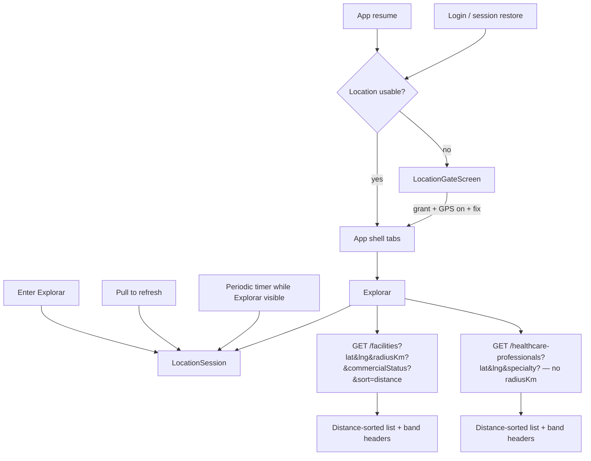

# Spec 0008 — Design: Explorar UX + location hard gate

**Status:** In progress (aligned with [requirements.md](./requirements.md) / [tasks.md](./tasks.md))  
**Last Updated:** 2026-07-23  

## Overview

Make mobile location a **session precondition**, then rebuild Explorar around API-backed distance (sort + optional clinic radius), **distance bands**, and a correct **Status** (`commercialStatus`) filter. Doctors share distance display/sort but not radius filtering.

## Architecture

### Location session

- Reuse `LocationService` / Geolocator.
- Own permission, services check, position + timeout.
- Router: authenticated && !usable → gate only.
- **Continuous watch while authenticated:** OS location-services stream + periodic soft revalidate (~20s) + app-resume recheck. Turning GPS/permission off mid-session clears usability and returns to the gate (no skip). Soft rechecks keep the last fix until failure is confirmed so Explorar refresh does not flash the gate.
- **No bypass flag** — enable Custom Location in iOS Simulator / Android emulator.

### Explorar data path

**Clinics**

- Always pass `latitude`/`longitude`.
- Default: no `radiusKm`. Chips `5|10|25|50|100`; clear chip → omit param.
- `sort=distance` when using search/Meili path; DB path distance-orders when coords present.
- Status → `commercialStatus` API enums with pt-BR labels.
- Client inserts band headers while iterating a distance-sorted page stream (`<2`, `2–10`, `10–25`, `≥25`, then nulls).

**Doctors**

- Pass `latitude`/`longitude` for `distanceKm` + distance order.
- **Never** pass `radiusKm`.
- Filter: `specialty` (existing). Expand later without clinic status/radius.

### GPS refresh policy

| Trigger | Action |
|---|---|
| Enter Explorar | `getCurrentPosition` → refetch active tab |
| Pull-to-refresh | same |
| Periodic (visible only) | suggested **90s** → refresh position → refetch if moved meaningfully (e.g. >150 m) or always refetch list |

## Gate UX (pt-BR)

Full-screen, no skip: headline + why + “Ativar localização” + “Tentar novamente” + open Settings when permanently denied.

## Filter UX

- Clinics filter sheet: **Status** + **Distância** (radius chips). Produtos deferred.
- Doctors filter sheet: **Especialidade** (no distância section).
- Active filters as removable chips on Explorar (clearing radius chip = no limit).

## API follow-ups

| Item | Need |
|---|---|
| GiST on `facilities.location` | Perf for `ST_DWithin` |
| `purchaseStatus` / `conformityStatus` list filters | If product picks those candidates |
| Multi status | Only if Q7c chooses multi-select |
| `productIds` | Already exists — wire catalog IDs |

## Testing

- Gate: no skip; resume returns to gate when permission revoked.
- Simulator: grant location manually; no code bypass.
- Clinics: no radius by default; chip adds `radiusKm`; clear removes it; bands appear in order.
- Doctors: distance shown; query has no `radiusKm`.
- Status sends `ACTIVE` etc., not `ativa`.
